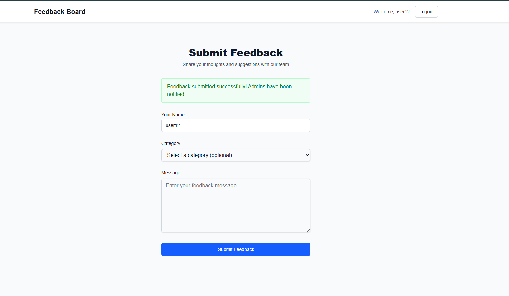
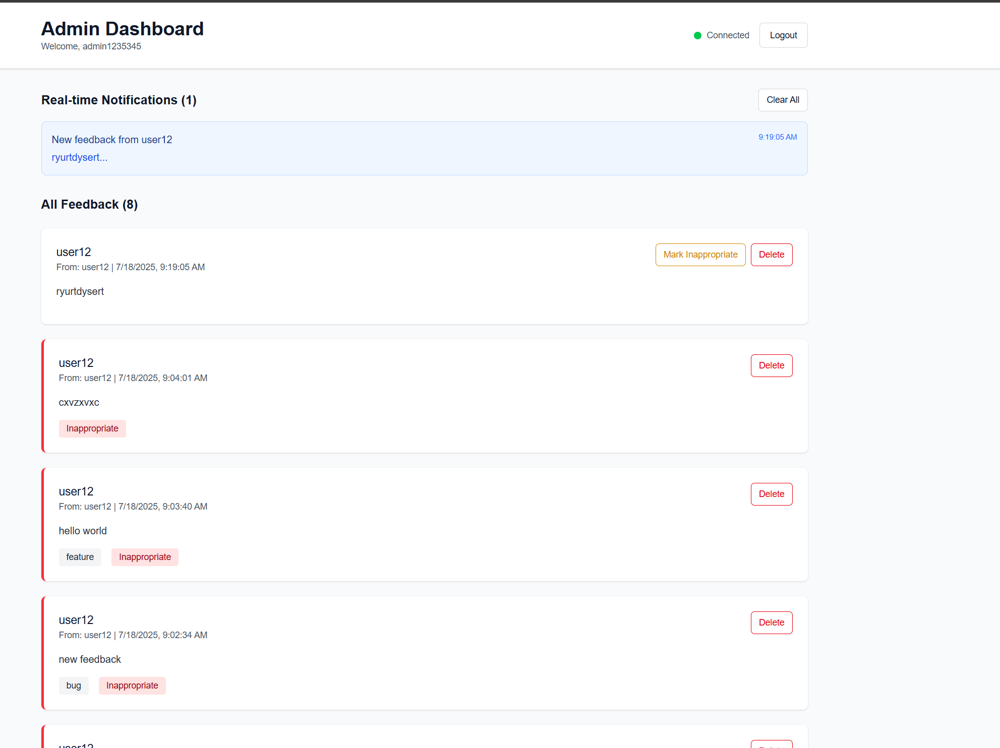

# Feedback Board Application

A real-time feedback board application built with NestJS backend and Next.js frontend, featuring WebSocket communication for live admin notifications.

## Features

- 🎯 **User Feedback**: Simple feedback form for users to submit name and message
- 🛠️ **Admin Dashboard**: Real-time dashboard to view, manage, and delete feedback
- 🔐 **Authentication**: JWT-based authentication with auto-registration
- ⚡ **Real-time Updates**: WebSocket integration for instant admin notifications
- 🐳 **Docker Support**: Full containerized setup with docker-compose
- 🌐 **CORS Enabled**: Cross-origin requests supported
- 🧪 **Testing**: Comprehensive unit tests for backend services with Jest

## Demo

🎥 **Live Demo**: [Watch the application in action](https://www.loom.com/share/3380c72667ab4f01953abc9ce9658840?sid=02192cca-fade-40ae-af43-e54582f80ce2)

*See the complete feedback board workflow including user registration, feedback submission, admin dashboard, and real-time notifications*

## Screenshots

### Feedback Board Dashboard



*User feedback interface where users can submit feedback with name, message, and category*

### Admin Dashboard



*Real-time admin dashboard showing all feedback with management capabilities*

## Tech Stack

- **Frontend**: Next.js 15, TypeScript, Tailwind CSS, Socket.IO Client
- **Backend**: NestJS, TypeScript, TypeORM, JWT, Socket.IO
- **Database**: MySQL 8.0
- **Testing**: Jest, @testing-library/react
- **Infrastructure**: Docker, Docker Compose

## Environment Configuration

This project uses a centralized `.env` file at the root directory that is shared across all services.

### Setup Instructions

1. **Copy the environment template**:

   ```bash
   cp .env.example .env
   ```

2. **Update the environment variables** in `.env` as needed:

   ```bash
   # Database Configuration
   DB_HOST=localhost
   DB_PORT=3307
   DB_USERNAME=feedback_user
   DB_PASSWORD=feedback_password
   DB_NAME=feedback_board

   # MySQL Root Password
   MYSQL_ROOT_PASSWORD=rootpassword

   # Application Configuration
   NODE_ENV=development

   # Backend Configuration
   BACKEND_PORT=3009
   PORT=3009

   # Frontend Configuration
   FRONTEND_PORT=3000
   FRONTEND_URL=http://localhost:3000
   NEXT_PUBLIC_API_URL=http://localhost:3009

   # WebSocket Configuration
   WEBSOCKET_PORT=3009
   NEXT_PUBLIC_WEBSOCKET_URL=http://localhost:3009

   # JWT Configuration
   JWT_SECRET=your-secret-key-change-this-in-production
   JWT_EXPIRES_IN=24h
   ```

3. **Frontend Environment Setup**:
   The frontend automatically loads environment variables from the root `.env` file via a symbolic link at `frontend/.env.local`. This link is already created and points to the root `.env` file.

4. **Run with Docker Compose**:

   ```bash
   # Start all services
   npm run dev
   ```

## Application URLs

- **Frontend**: <http://localhost:3000>
- **Backend API**: <http://localhost:3009>
- **Database**: localhost:3307

## User Registration

The application uses auto-registration - new users are automatically created on first login:

- Users with "admin" in their username are automatically granted admin privileges
- All other users are regular users who can submit feedback

## Application Flow

1. **Login Page** (`/login`): Single login form for all users
2. **User Dashboard** (`/feedback`): Submit feedback form for regular users  
3. **Admin Dashboard** (`/admin`): Real-time feedback management for admins

## API Endpoints

- `POST /auth/login` - User authentication
- `GET /feedback` - Get all feedback (admin only)
- `POST /feedback` - Submit new feedback
- `DELETE /feedback/:id` - Delete feedback (admin only)
- `PUT /feedback/:id/mark-inappropriate` - Mark feedback as inappropriate

## WebSocket Events

- `join-admin-room` - Join admin room for notifications
- `new-feedback` - Real-time feedback notification to admins

## Project Structure

```
├── .env                    # Centralized environment configuration
├── .env.example           # Environment template
├── docker-compose.yml     # Docker services configuration
├── package.json          # Root package.json with scripts
├── init.sql              # Database initialization
├── backend/              # NestJS backend
│   ├── src/
│   │   ├── auth/         # Authentication module
│   │   ├── feedback/     # Feedback module
│   │   ├── websocket/    # WebSocket gateway
│   │   └── main.ts       # Application entry point
│   └── package.json
└── frontend/             # Next.js frontend
    ├── src/
    │   ├── app/          # App router pages
    │   ├── components/   # Reusable components
    │   ├── lib/          # API clients and utilities
    │   └── types/        # TypeScript types
    └── package.json
```

## Testing

The application includes comprehensive unit tests for both backend and frontend services using Jest.

### Test Commands

```bash
# Test backend only
npm run test:backend

# Test frontend only  
npm run test:frontend

# Test everything (backend + frontend)
npm run test:all
```

## Quick Start

1. **Clone and setup**:

   ```bash
   git clone <repository-url>
   cd feedback-board
   cp .env.example .env
   # Update .env with your configuration
   ```

2. **Start the application**:

   ```bash
   docker-compose up --build
   ```

   This command will:
   - Build and start all services (MySQL, Backend, Frontend)
   - Set up the database with initial schema
   - Make the application available at <http://localhost:3000>

3. **Run tests** (optional):

   ```bash
   npm run test:all       # All tests
   npm run test:backend   # Backend only
   npm run test:frontend  # Frontend only
   ```
